\begin{titlepage}
\centering

{\LARGE\textsc{Ecole nationale de la statistique et de l'analyse de l'information}}
\vspace{0.5cm}

\includegraphics{Ensai-logo.png}\\
\vspace{0.3cm}

{\LARGE\textsc{Projet de traitement de données}}\\
\vspace{0.5cm}
{\large Élèves de première année}

\vspace{2.5cm}

\rule{\textwidth}{0.5mm}\\
\vspace{0.8cm}
{\huge\bfseries Rapport du projet de traitement de données}\\
\vspace{0.8cm}
\rule{\textwidth}{0.5mm}\\

\vspace{2.5cm}


\begin{flushleft}
\emph{Étudiants :}\\
Raphael Toreilles\\
Benjamin Blanc\\
Nathan Tiatia\\
\end{flushleft}

\vspace{2.5cm}

\begin{flushright}
\emph{Tuteur:}\\
Clément Valot\\
\end{flushright}


\vfill 
\begin{center}
École nationale de la statistique et de l’analyse de l’information\\
2025--2026
\end{center}
\end{titlepage}

\tableofcontents

\newpage

# Introduction

  Notre rapport présente une application concernant différents sports. Elle permet de modéliser et d'enrichir les données pour chaque joueur, équipe ou compétition, indifféramment du sport concerné. À la suite des succès des Jeux Olympiques et Paralympiques d'été à Paris ou d'hiver à Milan, une application telle que la notre satisfait la demande de nombreux individus souhaitant s'informer sur le monde du sport le plus efficacement possible.
  
  Ce projet a nécéssité la maitrise d'une large base de données concernant les joueurs et joueuses, les matchs et les compétitions de chaque sport. Concrètement, nous nous sommes mis comme objectif de produire une application diffusant une interface à un utilisateur. Usant de cet interface, l'utilisateur a la possibilité de chercher un joueur, une joueuse, une équipe, un match ou une compétition parmi ceux présents dans la base de données initiales. L'intérêt premier de cette application est de visualiser les diverses statistiques sportives générales à tous les sports -classement, défaites, victoires, etc- et d'autres statistiques spécifiques au sport concerné allant des rebonds au baketball au nombre de dragons ou drakes tués par une équipe sur League of Legends. Ces statistiques se visualisent soit directement sur l'interface, soit à travers des graphiques que l'application s'occupe de mettre en oeuvre. Dans un second temps, l'application possède aussi la fonctionnalité de mettre à jour la base de données avec de nouveaux matchs et de mettre à jour automatiquement les statistiques après mise à jour. Nous avons fait le choix de garder 5 sports: Basketball, Football, Tennis, Volleyball et League of Legends.
  
  Les données que nous avons sont d'abord sous le format de fichier CSV. Ce dernier, grace à un module parse_cv, est converti en python sous forme d'une liste de dictionnaire. Le format de chaque dictionnaire est spécifique mais utilisable à l'aide des clés qu'un dictionnaire se doit de posséder. Chaque ligne du CSV est un dictionnaire avec l'en-tête comme clé. Cette disposition nous permet, comme nous le verrons ensuite, d'uniformiser des données qui sont différentes pour chaque fichier CSV et de traiter correctement la base de données. Enfin, afin de traiter ces données dans l'optique de l'application, nous avons choisit de modéliser chaque objet utilisé et modélisé au sein de l'application. Comme nous le verrons dans le diagramme de classes, nous avons choisit certains objets afin d'en faire une classe composés d'attributs et de méthodes afin de calculer les statistiques et de faire fonctionner l'interface de l'application.

# I - Présentation générale du projet
## 1 - Cahier des charges

Le cahier des charges étant assez explicite, la majorité de cette partie se contentera de répondre aux exigences du projet par des diagrammes de différents types.

### Diagramme de classe

Nous avons d'abord voulu respecter la demande de formation de classes et de leurs modélisations au sein du cahier des charges. En effet, "l’application permet de créer des objets modélisant au minimum des matchs, des compétitions, des équipes ou des joueurs et joueuses". Chacune de ces classes sont explicitement demandées et nous avons pris comme choix de former ces classes selon les méthodes et attributs suivants.

```{mermaid}
classDiagram
    direction LR

    class Sport {
        +nom: str
        +__str__() str
    }

    class Match {
        +date: str
        +equipe_1, equipe_2: str
        +score_1, score_2: float
        +sport: str
        +run_menu(sport)$
    }

    class Joueur {
        +nom, prenom, pseudo: str
        +sport, equipe, position, pays: str
        +taille, poids: float
        +run_menu(sport)$
    }

    class Equipe {
        +nom, sport: str
        +matchs_joues, victoires, defaites, nuls, points: int
        +score_pour, score_contre: float
        +rebonds, passes: float
        +kills, dragons, barons: int
        +gold: float
        +difference_score() float
        +winrate() float
        +ajouter_match(s1, s2, nul)
        +run_menu(sport)$
    }

    class Competition {
        +nom, sport: str
        +equipes: dict
        +ajouter_equipe(cle, equipe)
        +classement_par(critere) list
        +run_menu(sport)$
    }

    %% ─────── Composition ───────
    Competition "1" *-- "0..*" Equipe : contient

    %% ─────── Sport en paramètre ───────
    Sport ..> Match       : run_menu
    Sport ..> Joueur      : run_menu
    Sport ..> Equipe      : run_menu
    Sport ..> Competition : run_menu
```


### Diagramme d'activité

L'application doit être en interaction avec l'utilisateur. Ce dernier peut alors chercher des statistiques, mettre à jour les données et les traiter si nécéssaire: "Il doit être possible d’ajouter les résultats d’une nouvelle compétition et de mettre à jour les caractéristiques des équipes ou des joueurs et joueuses en prenant en compte les nouveaux résultats." Le diagramme d'activité permet de mettre en exergue les relations entre l'application ou encore l'interface et l'utilisateur


```{mermaid}
%%| fig-width: 3.8
flowchart TB
    Start(((Début)))

    subgraph App["Application"]
        direction TB
        Load[Charger les CSV]
        MenuSport[Menu sport]
        Recognized{Sport reconnu ?}
        MenuCat[Menu catégorie]
        Process[Traiter les données]
        Result[Générer le résultat]
        Continue{Continuer ?}
        End[Message de fin]
        Stop(((Fin)))
    end

    subgraph User["Utilisateur"]
        direction TB
        InputSport[Saisit un sport]
        InputCat[Saisit une catégorie]
        ChooseRender[Choisit le rendu]
    end

    Start --> Load --> MenuSport --> InputSport --> Recognized
    Recognized -->|Non| MenuSport
    Recognized -->|Oui| MenuCat --> InputCat --> Process --> ChooseRender --> Result --> Continue
    Continue -->|Oui| MenuCat
    Continue -->|Non| End --> Stop

    classDef nodeStyle fill:#E8E6FA,stroke:#9A93D1,color:#1f1f3a
    classDef decisionStyle fill:#DDD8F5,stroke:#8780C8,color:#1f1f3a
    class Load,MenuSport,MenuCat,Process,Result,End,InputSport,InputCat,ChooseRender nodeStyle
    class Recognized,Continue decisionStyle
```

### Diagramme d'architecture 

Nous expliquerons en détail par la suite le fonctionnement de l'application. Le diagramme permet néanmoins de comprendre les différents niveaux sur lesquels l'application agit. Nous appelerons ces derniers des couches, soit des partie de l'architecture du code avec un but précis, ne pouvant modifier ou être modifié seulement par ses couches voisines. Cela nous permet de présenter une vue d'ensemble du projet avant de le détailler. Nous montrons ainsi l'organisation du code et les interactions entre module.


```{mermaid}
%%| fig-width: 7
flowchart TB
    %% ═══════════════ INTERFACE ═══════════════
    subgraph L0["① Interface · Point d'entrée"]
        Main["<b>__main__.py</b><br/><i>boucle principale</i><br/>menu sport → menu catégorie"]
    end

    %% ═══════════════ DOMAINE ═══════════════
    subgraph L1["② Couche domaine"]
        Sport["<b>Sport</b><br/><i>identifiant du sport</i>"]
    end

    %% ═══════════════ MODÈLES ═══════════════
    subgraph L2["③ Modèles métier"]
        direction LR
        Competition["<b>Competition</b><br/><i>nom · équipes (dict)</i>"]
        Equipe["<b>Equipe</b><br/><i>stats communes<br/>+ stats spécifiques</i>"]
        Match["<b>Match</b><br/><i>date · équipes · scores</i>"]
        Joueur["<b>Joueur</b><br/><i>nom · classement · stats</i>"]
    end

    %% ═══════════════ DISPATCHERS ═══════════════
    subgraph L3["④ Loaders · Dispatchers (façades)"]
        direction LR
        CL["CompetitionLoader"]
        EL["EquipeLoader"]
        ML["MatchLoader"]
        JL["JoueurLoader"]
        GR["<b>GestionResultats</b>"]
    end

    %% Hub d'agrégation
    Hub(( )):::hub

    %% ═══════════════ LOADERS SPORT ═══════════════
    subgraph L4["⑤ Loaders sport-spécifiques"]
        direction LR
        Foot["FootballLoader"]
        Bask["BasketballLoader"]
        LoL["LoLLoader"]
        Tenn["TennisLoader"]
        Vol["VolleyLoader"]
        GRW["GestionResultats<br/><i>write_csv</i>"]
    end

    %% ═══════════════ DONNÉES ═══════════════
    subgraph L5["⑥ Données CSV"]
        direction LR
        F[("football/<br/><i>match · team<br/>league · country</i>")]
        B[("basketball/<br/><i>game · team · player</i>")]
        Ld[("LOL/<br/><i>match · team</i>")]
        T[("tennis/<br/><i>atp/wta_matches<br/>atp/wta_players</i>")]
        V[("volley/<br/><i>match_men · match_women<br/>country</i>")]
        R[("resultats/<br/><i>nouveaux_matchs.csv</i>")]
    end

    %% ═══════════════ VISUALISATION ═══════════════
    subgraph L6["⑦ Visualisation & Analyse"]
        direction LR
        Classement["<b>ClassementVisualizer</b><br/><i>foot · basket · LoL<br/>tennis · volley</i>"]
        Analysis["<b>Analysis</b><br/><i>pandas · GoalPredict<br/>statistiques avancées</i>"]
    end

    %% ═══════════════ SORTIES ═══════════════
    subgraph L7["⑧ Sorties"]
        direction LR
        PNG[/"output/*.png<br/><i>tableaux & graphiques</i>"/]
        Term[/"Terminal (stdout)<br/><i>classements · stats<br/>historique · recherche</i>"/]
    end

    %% ─────── Flux principal ───────
    Main --> Sport
    Sport --> L2

    Competition --> CL
    Equipe       --> EL
    Match        --> ML
    Joueur       --> JL

    %% Convergence : 4 dispatchers → hub → 5 loaders sport
    CL & EL & ML & JL ==> Hub
    Hub ==> Foot & Bask & LoL & Tenn & Vol

    %% Branche persistance
    GR --> GRW --> R

    %% Loaders sport ↔ CSV (1-pour-1)
    Foot --> F
    Bask --> B
    LoL  --> Ld
    Tenn --> T
    Vol  --> V

    %% Sorties
    Foot -.-> Classement
    Classement --> Analysis & PNG
    Analysis   --> PNG
    GR -.-> Term

    %% ─────── Styles ───────
    classDef l0 fill:#FFFCE0,stroke:#1E293B,stroke-width:1.5px,color:#0F172A
    classDef l1 fill:#FEF2F2,stroke:#991B1B,stroke-width:1.5px,color:#0F172A
    classDef l2 fill:#EFF6FF,stroke:#1E40AF,stroke-width:1.5px,color:#0F172A
    classDef l3 fill:#F0FDF4,stroke:#166534,stroke-width:1.5px,color:#0F172A
    classDef l4 fill:#ECFDF5,stroke:#047857,stroke-width:1.5px,color:#0F172A
    classDef l5 fill:#FFF7ED,stroke:#9A3412,stroke-width:1.5px,color:#0F172A
    classDef l6 fill:#F5F3FF,stroke:#5B21B6,stroke-width:1.5px,color:#0F172A
    classDef l7 fill:#F1F5F9,stroke:#0F172A,stroke-width:1.5px,color:#0F172A
    classDef hub fill:#475569,stroke:#1E293B,stroke-width:2px,color:#F8FAFC

    class Main l0
    class Sport l1
    class Competition,Equipe,Match,Joueur l2
    class CL,EL,ML,JL,GR l3
    class Foot,Bask,LoL,Tenn,Vol,GRW l4
    class F,B,Ld,T,V,R l5
    class Classement,Analysis l6
    class PNG,Term l7
```


## 2 - Gestion du projet par le groupe

### Modèle de données 

Pour notre application, nous avons choisi de traiter cinq sports: le football, le basketball, le tennis, le volleyball et l'e-sport (League of Legends). Les données initiales, qui représentent la matière première du projet, sont toutes hétérogènes d'un sport à l'autre, ce qui a pu constituer un premier obstacle à la mise en forme de notre application. Par exemple, 5 fichiers CSV viennent avec le dossier zip sur les data football: country.csv, league.csv, match.csv, player.csv et team.csv. En comparaison, le zip "tennis" possèdent les CSV suivant: atp_matches_2024.csv, atp_players_2024.csv, wta_matches_2024.csv et wta_players_2024.csv. Mais encore, l'hétérogénéité est présente au sein même des CSV. Pour le fichier player.csv de football, les caractéristiques des joueurs sont : id, player_api_id, player_name, birthday, weight (kg), height (cm). D'un autre côté, le fichier wta_players_2024.csv donne les caractéristiques suivantes pour les joueuses de tennis: player_id, name_first, name_last, hand, dob, ioc, height. Chaque sport a son propre schéma de colonnes, ses propres identifiants, ses propres unités.

Football est la base de données la plus conséquente. Presque 26 000 lignes sur le fichier match.csv avec 33 colonnes sont répartis sur les 11 ligues européennes. Les 4 fichiers csv sont à joindres pour avoir des informations utiles: par exemple pour afficher  "Ligue 1 — France — PSG 2-1 Lyon", il faut traverser ces 4 fichiers. Le basketball a le dataset le plus enrichi avec 43 colonnes de stats pour les matchs d'une saison NBA: tirs à 2pts, tirs à 3pts, lancers francs (tentatives + réussis + pourcentage), rebonds offensifs et défensifs, passes décisives, interceptions, contres, balles perdues, fautes, points totaux. La base de données de League of Legends au contraire du football, est la plus petite. Chaque match contient: composition complète par rôle (top, jungle, mid, bot, support pour chaque équipe), les 5 picks et 5 bans de chaque côté, et les stats d'objectifs (dragons, barons, tourelles, gold, kills, assists, deaths). Le tennis est divisé en deux circuits avec des match ATP et WTA de 2024. Ce qui fait qu'on ne peut pas traiter de manière similaire les résultats dans ces deux tournois par exemple (l'un utilisant best of 3, le second best of 5). Néanmoins, ici aussi chaque statistiques de match est très détaillées: aces, doubles-fautes, points de service joués, 1er service entré, 1er et  2e service gagnés, jeux de service, balles de break sauvées/concédées et le temps du match en minutes. Enfin le dataset volleyball est le plus simplifié. Il concerne 26 matchs pour chaque sexe. La structure de match.csv est réduite à l'essentiel : date, phase de compétition (stage), codes pays des deux équipes, et nombre de sets gagnés par chacun. En accord avec le cahier des charges, nous avons décider d'accepter ces différences au sein de chaque CSV. C'est surtout à travers les Loaders que nous avons cherché à réduire cette hétérogéneité.

### Le choix des Loaders

Les 5 sports ont des fichiers CSV incompatibles entre eux. Il est nécéssaire de construire des Loaders afin d'éviter une redondance dans le code de l'application avec, à chaque fonctionnalité, un if sport == "football" ... elif sport  
  == "basketball" etc. Nous expliquerons en détail l'utilisation des Loaders et leur utilité dans la seconde partie. Nous avons choisi de former 4 classes de Loaders. Une correspondant à chaque classe du diagramme : MatchLoader, JoueurLoader, CompetitionLoader, EquipeLoader. MatchLoader normalise les données hétérogènes en objets Match uniformes pour tous les sports. JoueurLoader charge la liste des joueurs et affiche les statistiques pour chaque sports. EquipeLoader affiche les statistiques d'une équipe précise au sein d'une saison. Enfin CompetitionLoader affiche les classements d'une compétition sous plusieurs angles (points, attaque, défense, rebonds…). Dans cette optique nous avons choisit d'utiliser pandas afin de construire des dataframes normalisés avec les Loader, mais aussi de filter certaines données et statistiques, voire les visualiser. Nous pouvons aussi identifier le cas complexe de la classe GestionResultat. Ce dernier s'occupe d'ajouter et de mettre à jour les données imputés via l'interface. Les nouveaux matchs sont alors concaténés à la liste de matchs déjà existant. Le problème étant alors la mise à jour des équipes et des compétitions en lien avec ces nouveux matchs, GestionResultat s'occupe d'appliquer la mise à jour à la classe Competition et Match grâce aux méthodes appliquer_a_equipe() et appliquer_a_competition(). Les tests ont permis la bonne utilisation de GestionResultat ainsi que de tous les Loaders, nous approfondirons quelque peu par la suite ces tests.
  
### La visualisation

Afin de permettre la visualisation nous avons nécéssité l'utilisation de pandas et de matplotlib. Si pandas servaient d'abord à normaliser les données, il est par la suite devenue un outil de modélisation et de visualisation statistique de par l'utilisation de ses dataframes. Pour ce faire, ce sont des calculs entre les dataframes qui permettent par la suite de mettre en place des graphiques. Par exemple: pd.concat([df["pts_home"], df["pts_away"]]) fusionne les points domicile et extérieur en une seule série pour calculer la distribution globale des scores.
Ensuite nous modélisons avec matplotlib, une bibliothèque de visualisation Python. Ce dernier permet de faire les graphiques statistiques: ax.hist pour les distributions ou encore ax.pie pour les camemberts par exemple. Ces graphiques sont générées sous forme de PNG à l'aide de matplotlib.use("Agg"). Afin d'éviter la répétition du code pour chaque graphiques de formes similaires, on utilise la fonction _style(ax, titre="", xlabel="", ylabel="") qui permet de mettre en place les réglages nécéssaires pour éviter la répétition. La visualisation se forme avec le module GraphiqueSport qui génère des graphiques couvrant tout les sports. Ces derniers sont générés dans la section output.

### Les tests

Dans l'ensemble, 71 tests ont été codés. Les 71 passent tous en 0.6 secondes. Nous avons décidé de tester en majorité les classes demandées explicitement par le cahier des charges. Le module test_Equipe.py est le fichier le plus dense (15 tests). Il vérifie toute la logique de ajouter_match : victoire, défaite, nul, cumul sur plusieurs matchs, nul_possible=False pour les sports sans match nul, et les propriétés calculées difference_score et winrate. Par la suite, test_Competition.py vérifie que classement_par produit un classement trié correctement selon n'importe quel attribut d'Equipe, et qu'une équipe existante peut être remplacée. test_Match.py vérifie que les champs optionnels spécifiques à chaque sport (par exemple patch pour LoL ou surface pour le tennis) sont bien None par défaut et correctement assignés quand ces derniers sont fournis. De par la compléxité de la classe GestionResultat, test_GestionResultat est le plus fournit en tests. Le module test_registries.py vérifie que les 5 sports sont bien enregistrés dans les 4 Loaders après l'importation des bases de données initiales: def test_match_loaders_tous_enregistres():
      assert set(MatchLoader._loaders.keys()) == {"basketball", "football", "LOL","tennis", "volley"}  
Néanmoins, beaucoup des fonctionnalités ne sont pas couvertes. Les Loaders et les ont très peu de tests et les Visualizers n'en ont aucun. La difficulté réside d'une part ici dans la lecture de fichier CSV. D'autre part la plupart des fonctionnalités nécéssite un input(). La stratégie que nous avons adoptée est donc de concentrer les tests sur les classes de base et GestionResultat.

# II - La structure du code
## Les Loaders

Tout d’abord, afin d’importer correctement les données, nous avons choisi l’utilisation de loaders. Les fichiers bruts étant au format CSV, nous avons utilisé la librairie pandas afin de transformer ces fichiers en DataFrames, c’est-à-dire en tableaux de données facilement manipulables en Python. Cette première étape permet de lire les fichiers contenant les informations sur les matchs, les joueurs, les équipes ou encore les compétitions.
Le but des Loaders est de servir d’intermédiaire entre les données et le reste du programme. Les fichiers CSV contiennent les données utilisées durant le projet, mais elles ne peuvent pas être utilisées directement, car leur structure varie selon les sports et les fichiers. Les loaders ont donc pour rôle de lire ces fichiers, de sélectionner les informations utiles, de nettoyer et transformer les données, puis de convertir les lignes en objets Python utilisables par l’application. Ils permettent ainsi de mettre dans le même format toutes les données issues des fichiers csv afin que le reste du programme puisse fonctionner de manière identique. Cette approche améliore l’organisation du code et permet d’ajouter plus facilement de nouvelles sources de données. 

Les fichiers CSV contiennent donc les données, mais la structure n’est pas la même d’un fichier à l’autre. Par exemple, pour les joueurs, certains fichiers utilisent des identifiants (ID) alors que d’autres non, et chaque sport possède également ses propres statistiques spécifiques. Il en est de même pour les matchs, les équipes ou les compétitions, dont les colonnes et l’organisation varient selon les sources de données. Afin de gérer cette hétérogénéité, les loaders utilisent plusieurs méthodes de la librairie pandas. Certaines colonnes sont sélectionnées afin de ne conserver que les informations utiles au programme. Des transformations sont également appliquées pour convertir certains identifiants en chaînes de caractères. . Enfin, un nouveau DataFrame standardisé est reconstruit. Pour cela, une ligne est transformé en dictionnaire, et avec la méthode (**r), chaque ligne est transformée en classe avec comme paramètre les valeurs du dictionnaire.
Les loaders du projet sont séparés en deux catégories : les loaders génériques et les loaders spécifiques. Les loaders génériques, comme MatchLoader, JoueurLoader, EquipeLoader ou CompetitionLoader, ne lisent pas directement les fichiers CSV. Leur rôle est de servir d’intermédiaires entre le programme et les loaders spécialisés. Ils permettent au reste de l’application d’utiliser toujours les mêmes méthodes, quel que soit le sport choisi.

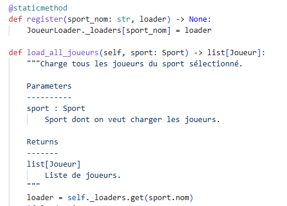

Les loaders spécifiques, comme FootballMatchLoader, BasketballJoueurLoader ou TennisCompetitionLoader, sont quant à eux responsables du traitement réel des données. Ils lisent les fichiers CSV associés à leur sport, sélectionnent les colonnes utiles, nettoient et transforment les données, puis créent les objets Python utilisés dans le programme. Cette séparation permet d’avoir une architecture plus claire et plus modulaire, où chaque loader possède une responsabilité précise. 
Afin de relier les loaders génériques aux loaders spécifiques, le projet utilise un système de registre avec des instructions comme MatchLoader.register("football", FootballMatchLoader). Lors de l’import des fichiers dans __main__.py, ces lignes sont automatiquement exécutées et enregistrent dans un dictionnaire quel loader doit être utilisé pour chaque sport. Ainsi, lorsque l’utilisateur choisit un sport dans l’application, le loader générique peut retrouver automatiquement le loader spécialisé correspondant et l’utiliser pour charger les données. Ce système permet d’ajouter facilement un nouveau sport sans modifier le reste du programme : il suffit de créer un nouveau loader spécifique puis de l’enregistrer avec register().

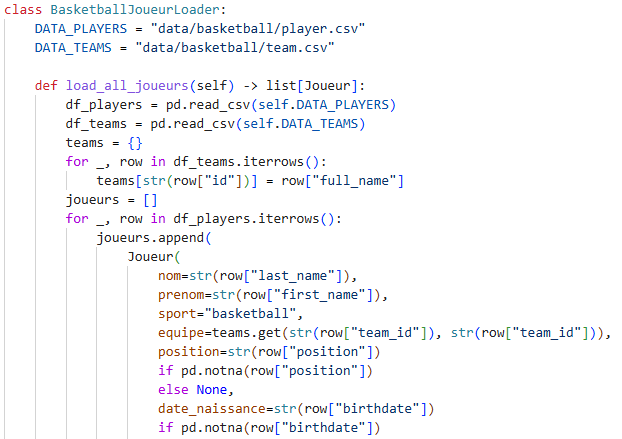


## La programmation orientée objet

Nous avons utilisé la programmation orientée objet dans ce projet afin de représenter de manière claire les différentes entités manipulées par l’application, comme les matchs, les joueurs, les équipes ou les compétitions. Le projet manipulant de nombreuses données provenant de sports différents, cela permet d’organiser le code en séparant les responsabilités de chaque classe. Chaque objet possède ainsi ses propres attributs et méthodes, ce qui facilite la gestion des données, les traitements statistiques et les visualisations. Cela permet aussi d’ajouter plus facilement de nouvelles données.

Classe Joueur
La classe Joueur représente un joueur appartenant à un sport donné. Un joueur est défini par son nom et son sport, mais la classe contient d’autres paramètres optionnels qui correspondent aux informations des joueurs, comme la taille ou le poste, qui ne seront présents que si l’information est dans les fichiers d’import. (Par exemple, la taille n’est pas présente pour les joueurs de LOL car cette information n’est pas pertinente). Afin de simplifier, nous avons créer un seul attribut position qui peut fonctionner pour plusieurs 


sports (basket, LOL …), bien que ces positions soient spécifiques à chaque sport

La classe possède aussi des méthodes permettant de trier les joueurs selon certaines caractéristiques afin d’avoir des statistiques par la suite (exemple : _chercher_par_nom, _chercher_par_pays)

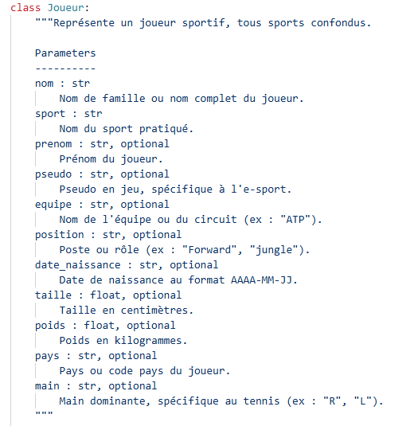

Classe Équipe

La classe Equipe représente une équipe. Elle est définie par un nom, un sport et une abréviation. Des statistiques sont aussi présentes en attribut, comme le nombre de matchs joués, le nombre de matchs gagnés … Ces statistiques sont obtenues en agrégant depuis le fichier des matchs par équipe. Il existe aussi des statistiques présentes seulement pour un sport, on peut prendre comme exemple les dragons pour LOL. Nous avons fait le choix de mettre les statistiques dans la classe équipe plutôt que dans la classe match car tout d’abord, comme nous le verrons après, la classe match est très simplifié, et aussi car nous avons pensé qu’il était plus intéressant pour un utilisateur d’avoir des statistiques sur l’année plutôt que par match. En effet, de cette manière il est plus facile de comparer entre les équipes, et cela représente mieux la réussite d’une équipe.
Classe Match
La classe Match représente une rencontre sportive entre deux équipes ou deux joueurs appartenant à un sport donné. Un match est défini principalement par une date, deux participants (equipe_1 et equipe_2), leurs scores respectifs ainsi que le sport concerné. La classe contient également certains paramètres optionnels correspondant à des informations spécifiques à certains sports, comme la surface et le tournoi pour le tennis, ou encore le patch pour League of Legends. Ces attributs ne sont présents que si les informations existent dans les fichiers d’import. Afin d’uniformiser la structure des données entre les sports, nous avons choisi d’utiliser des attributs génériques comme score_1 et score_2, même si la signification exacte du score peut varier selon le sport (buts au football, points au basketball, kills pour LOL, sets au volley…).
La classe Match est volontairement plus simple que la classe Equipe, car nous avons fait le choix de stocker la majorité des statistiques agrégées directement dans les équipes plutôt que dans chaque match individuellement. Les objets Match servent donc principalement à représenter les données brutes des rencontres et à alimenter ensuite les statistiques des équipes et des compétitions. Cette simplification permet également d’avoir une structure commune plus facilement adaptable à des sports très différents.
Tout comme la classe Joueur, elle possède aussi des méthodes utilisées par l'application afin d'obtenir des statistiques et des rendus visuels.

Classe Competition
La classe Competition représente une compétition ou un championnat regroupant plusieurs équipes appartenant à un sport donné. Une compétition est définie principalement par son nom et son sport. Elle contient une méthode lui permettant de rajouter des équipes à la compétition et de les stocker dans un dictionnaire afin de pouvoir les retrouver et les manipuler facilement par la suite. La classe possède également des méthodes permettant de trier les équipes selon différents critères statistiques, comme le nombre de points, le nombre de victoires ou la différence de score, afin de générer des classements. Cette classe joue donc un rôle central dans l’organisation des données sportives, puisqu’elle permet de regrouper les équipes d’un même championnat et de comparer leurs performances sur l’ensemble d’une saison.

## L'application/déroulement du programme

Afin de lancer l’application, l’utilisateur passe par le terminal, il doit exécuter le fichier __main__.py.  Ce fichier joue le rôle de point d’entrée du programme. Sa première fonction est d’importer l’ensemble des loaders afin d’utiliser les données souhaitées par l’utilisateur
Le fichier main contient donc des fonctions permettant la visualisation de l’appli, comme l’en-tête. Ensuite, une fonction demande à l’utilisateur le sport qu’il souhaite consulter, puis la catégorie des données qu’il souhaite consulter.

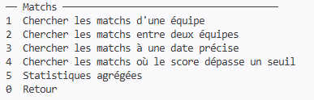


Ici, si l’utilisateur choisit joueur, équipe, compétition ou match, l’appli fera appel à la méthode run_menu qui est présente dans chacune de ces classes, et qui fera apparaître un menu déroulant faisant appel aux méthodes de cette même classe, afin d’obtenir des statistiques. Voici un exemple avec la classe match : 

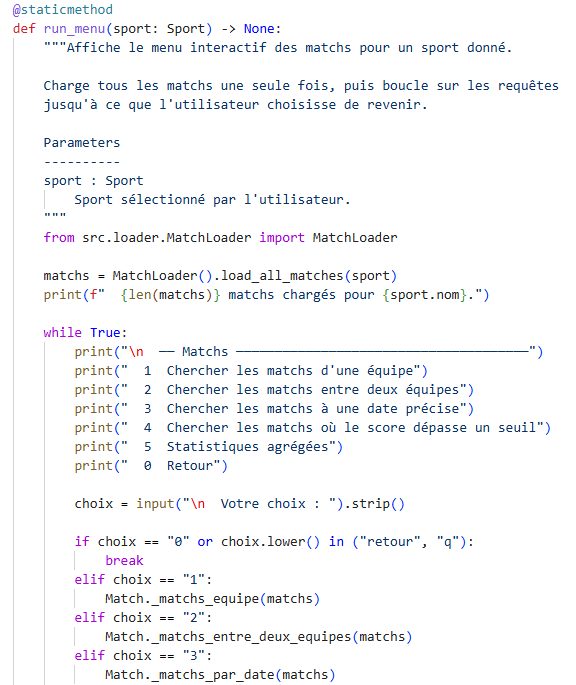


Ici, si l’utilisateur sélectionne dans ‘match’ touts les matchs d’une certaine équipe, au sein de la classe équipe run_menu fera appel à la méthode suivante, et les résultats s’afficheront dans le terminal :


Pour les graphiques, on fait appel au fichier GraphiqueSport, qui contient des fonctions permettant de construire des graphiques à l’aide des librairies pandas, numpy ainsi que matplotlyb.
Il existe des graphiques spécifiques pour chaque sport afin de mettre en avant des statistiques adaptées aux données disponibles. Par exemple, pour le football, certains graphiques représentent le nombre de buts par journée ou la comparaison entre attaque et défense des équipes, là ou pour le basketball, des visualisations sont réalisées sur la distribution des scores ou les joueurs réalisant le plus de rebonds.
Il existe aussi une fonction permettant à l’utilisateur d’ajouter lui-même des résultats de match. Cette fonctionnalité passe par la classe GestionResultats, qui permet de sauvegarder de nouveaux matchs saisis directement depuis le terminal. L’utilisateur renseigne les informations nécessaires, comme le sport, la date, les équipes concernées ainsi que les scores du match. Ces nouvelles données sont ensuite enregistrées dans un fichier CSV situé dans data/resultats/nouveaux_matchs.csv. Ces nouveaux matchs sont donc par la suite utilisés lors des calculs des statistiques.

# III - Les résultats

Etude 1 :

L'utilisateur est l'entraineur du Paris Saint-Germain, il souhaite préparer son match de vendredi face à l'Olympique de Marseille.
Il effectue alors des recherches statistiques sur l'équipe.

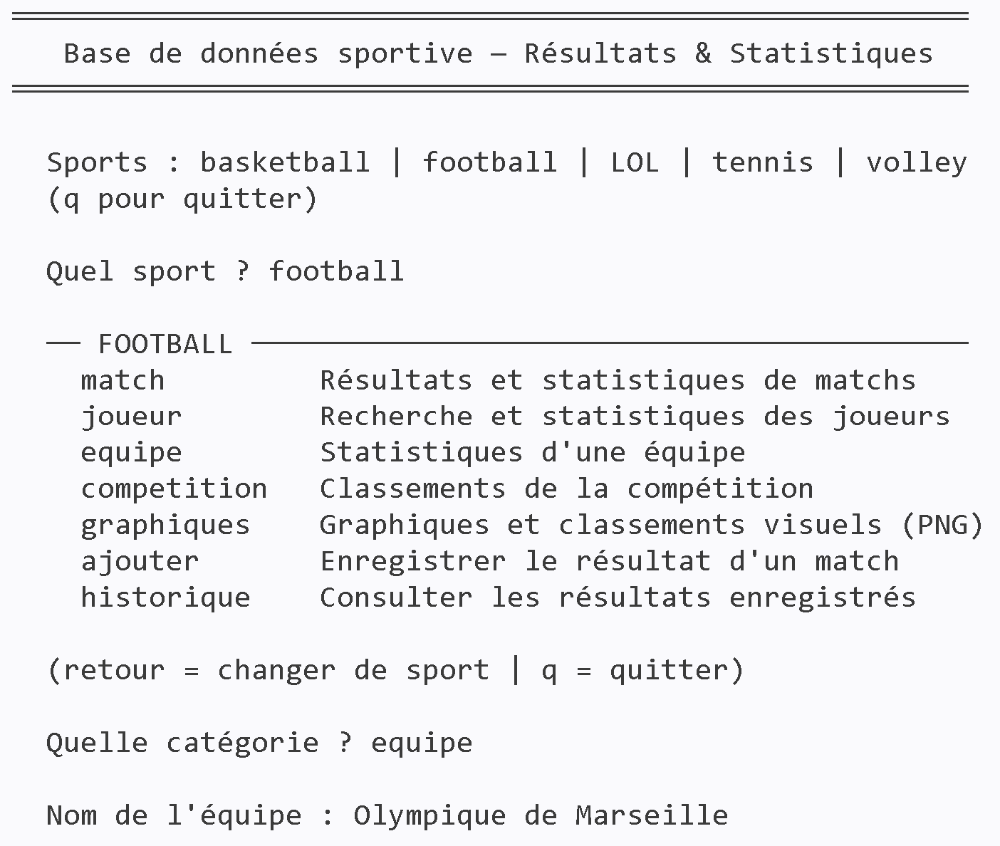{fig-align="center" width="80%"}

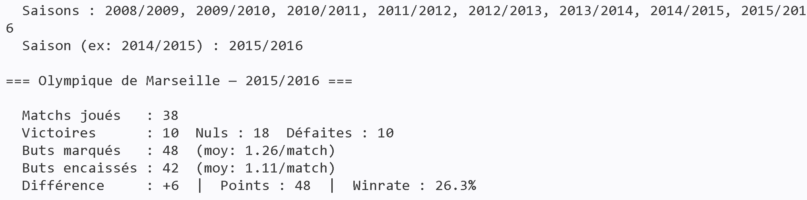{fig-align="center" width="80%"}

Il décide ensuite de comparer les deux équipes.

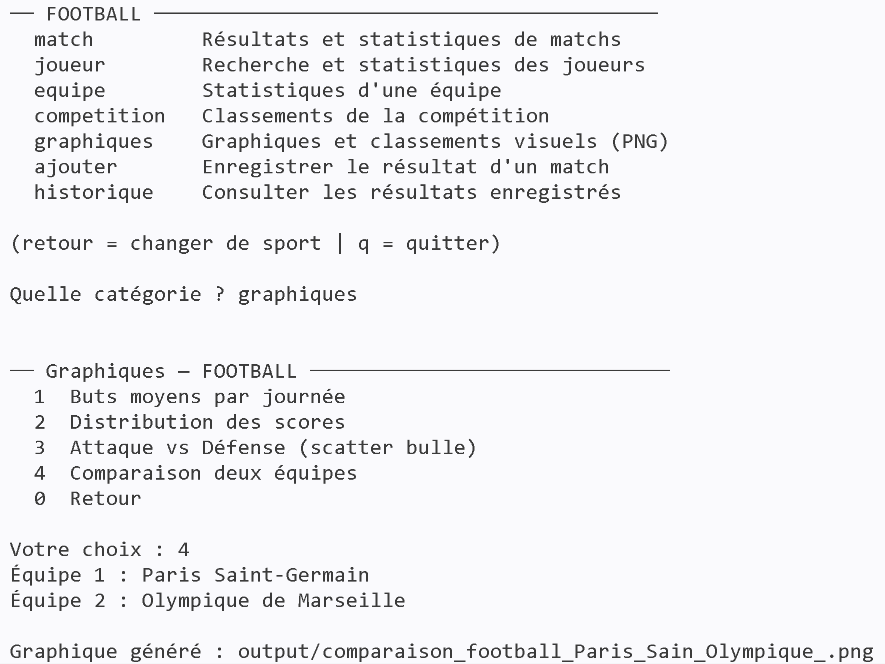{fig-align="center" width="80%"}

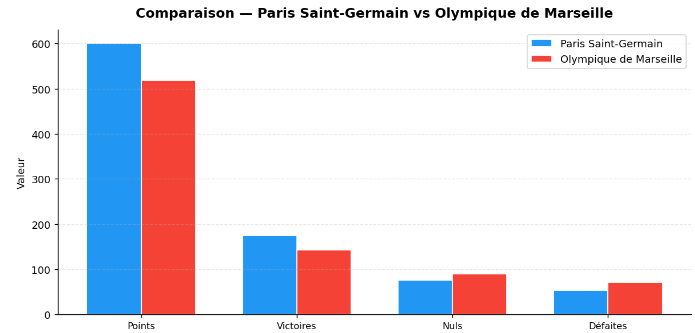{fig-align="center" width="80%"}

Etude 2 :

L'utilisateur, un montpelliérain, est nostalgique de la saison 2011/2012.

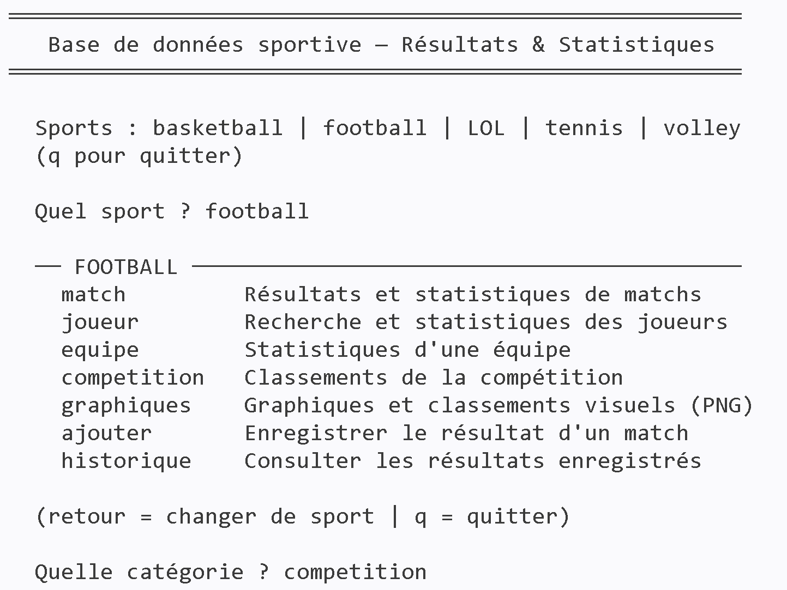{fig-align="center" width="80%"}

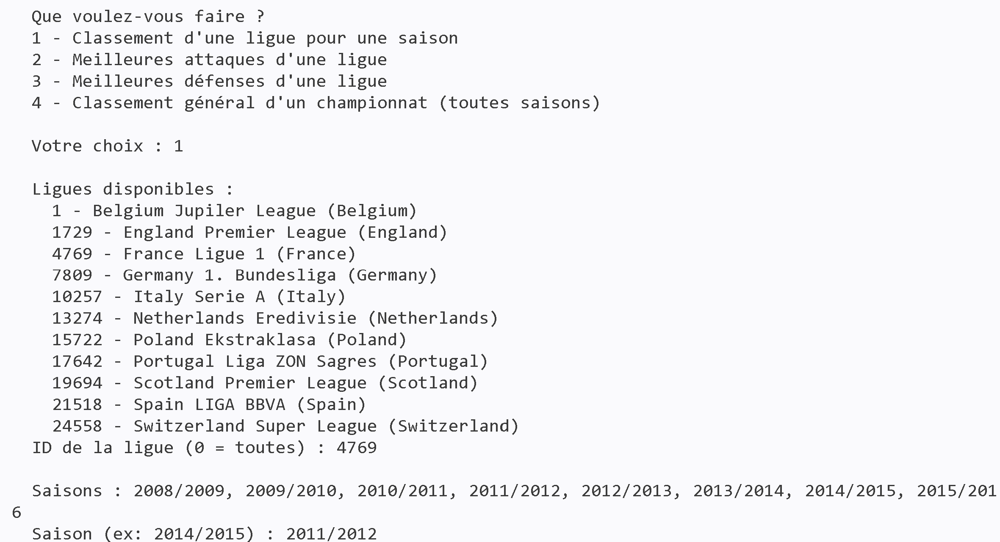{fig-align="center" width="80%"}

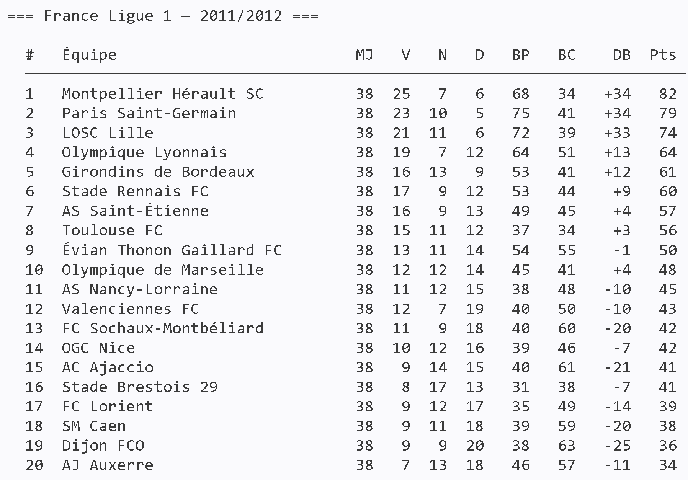{fig-align="center" width="80%"}

Etude 3 :

Un fan de basket entend parler d'un Jonathan Isaac. Mais il ne le connaît pas, il décide alors de lancer une requête pour avoir des informations sur lui.

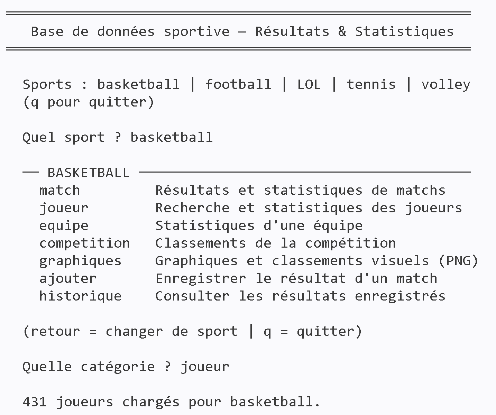{fig-align="center" width="80%"}

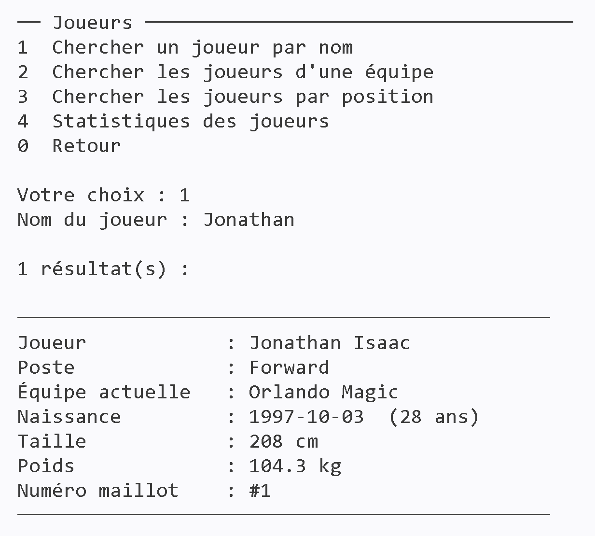{fig-align="center" width="80%"}

Etude 4 :

Deux amis débattent sur la meilleure équipe entre les Lakers et les Celtics. Ils décident alors de regarder les deux derniers matchs les opposant.

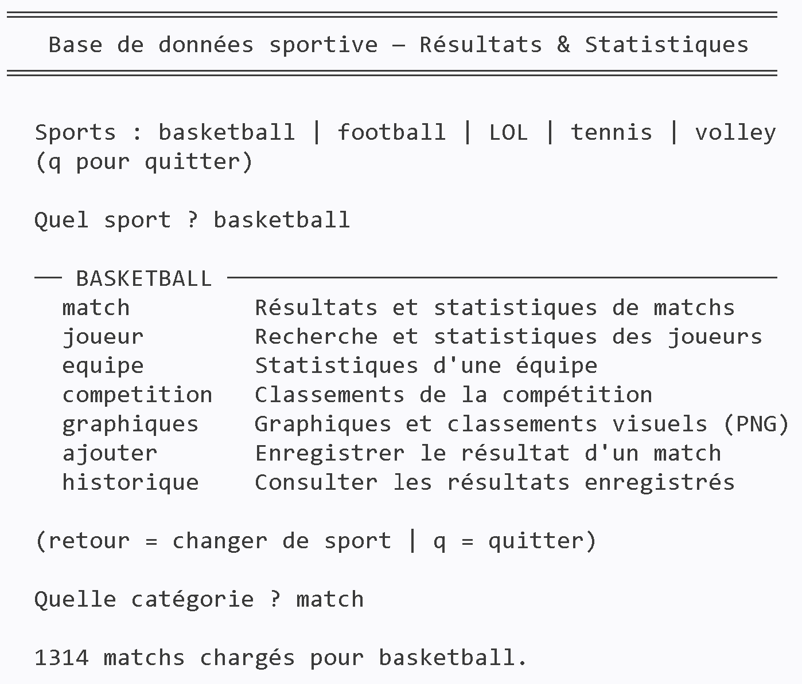{fig-align="center" width="80%"}

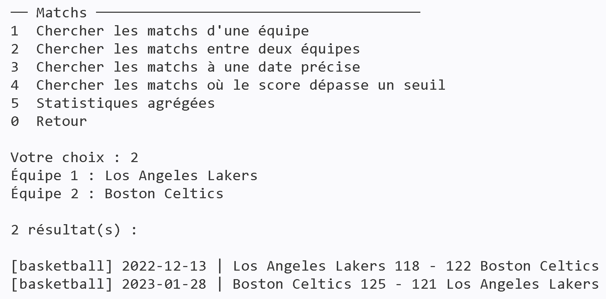{fig-align="center" width="80%"}

Etude 5 :

Une étude est menée par l'INSEE par rapport à la domination de certaines nationalités au tennis. Les chercheurs souhaitent connaître les nationalités des joueurs pro de tennis.

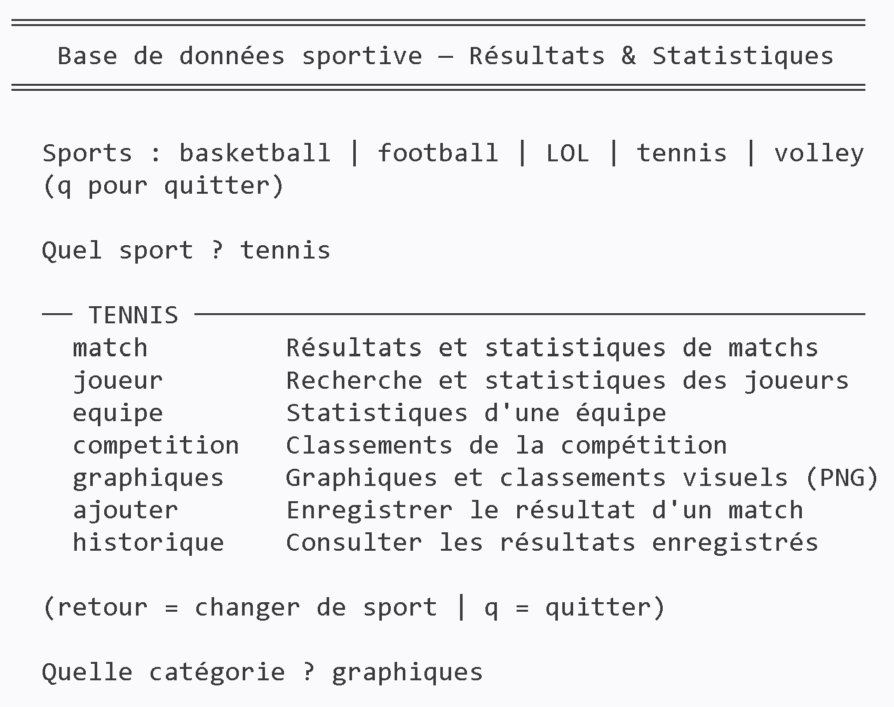{fig-align="center" width="80%"}

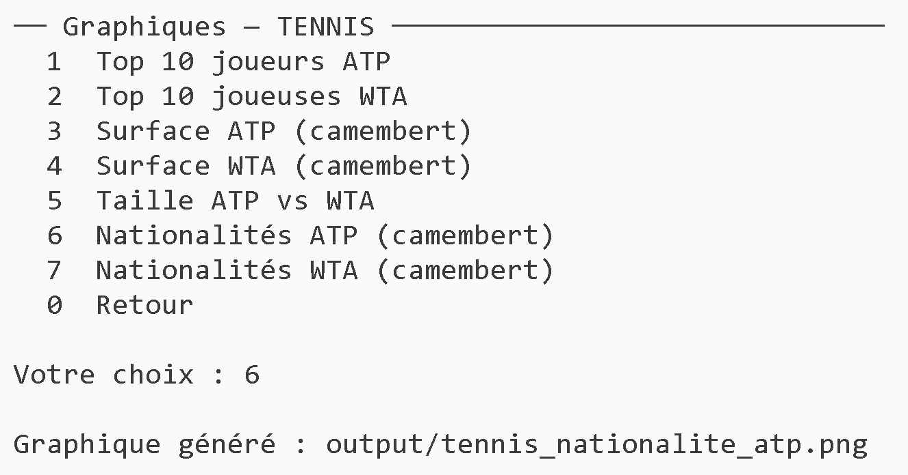{fig-align="center" width="80%"}

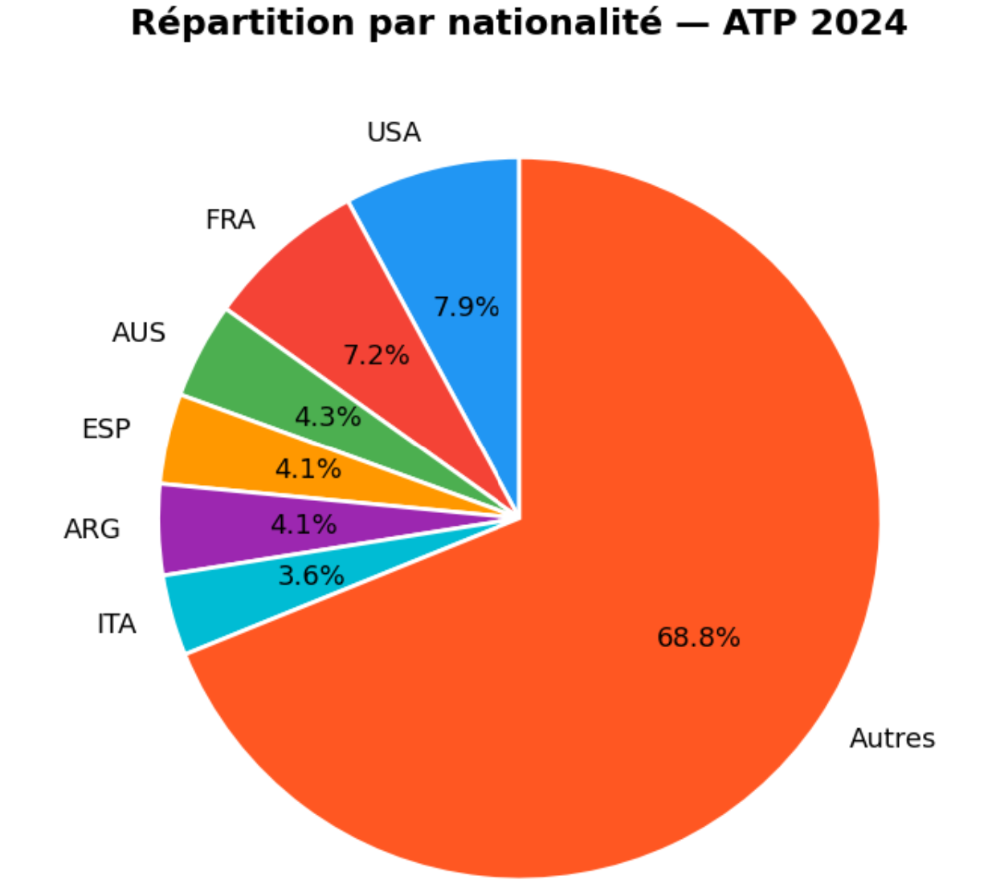{fig-align="center" width="80%"}

# Conclusion

\newpage

# Annexe

## Diagrammes des sous-menus

```{mermaid}
%%| fig-cap: "Sous-menu Joueur/Joueuse"
%%| fig-width: 5.5
flowchart TD
    START([Entrée dans le sous-menu Joueur])
    START --> LOAD[JoueurLoader.load_all_joueurs<br/>Chargement de tous les joueurs du sport]

    LOAD --> MENU{Choix de l'action}

    MENU -->|1| E1[/Saisie : nom ou prénom/]
    MENU -->|2| E2[/Saisie : nom de l'équipe/]
    MENU -->|3| E3[/Saisie : pays ou nationalité/]
    MENU -->|4| E4[/Saisie : position ou rôle/]
    MENU -->|5| E5[Afficher le Top N<br/>par statistique]
    MENU -->|0| BACK([Retour menu catégorie])

    E1 --> F1[Filtre joueurs dont le nom<br/>contient la saisie]
    E2 --> F2[Filtre joueurs appartenant<br/>à l'équipe saisie]
    E3 --> F3[Filtre joueurs du pays<br/>ou nationalité saisis]
    E4 --> F4[Filtre joueurs par position<br/>ou rôle ex : forward top jungle]
    E5 --> F5[/Saisie : critère taille poids âge/]
    F5 --> S5[Tri et affichage<br/>Top N joueurs]

    F1 --> AFF[Affichage terminal<br/>nom · équipe · position · pays]
    F2 --> AFF
    F3 --> AFF
    F4 --> AFF
    S5 --> AFF
    AFF --> MENU
```

```{mermaid}
%%| fig-cap: "Sous-menu Match"
%%| fig-width: 5.5
flowchart TD
    START([Entrée dans le sous-menu Match])
    START --> LOAD[MatchLoader.load_all_matches<br/>Chargement de tous les matchs du sport]

    LOAD --> MENU{Choix de l'action}

    MENU -->|1| E1[/Saisie : nom de l'équipe/]
    MENU -->|2| E2[/Saisie : équipe 1 et équipe 2/]
    MENU -->|3| E3[/Saisie : date AAAA-MM-JJ/]
    MENU -->|4| E4[/Saisie : score minimum/]
    MENU -->|5| E5[/Filtrer une équipe ? optionnel/]
    MENU -->|0| BACK([Retour menu catégorie])

    E1 --> F1[Filtre matchs contenant<br/>le nom de l'équipe]
    E2 --> F2[Filtre confrontations<br/>directes entre les deux équipes]
    E3 --> F3[Filtre matchs correspondant<br/>à la date saisie]
    E4 --> D4{Score valide ?}
    D4 -->|Non| ERR4[Saisie invalide<br/>→ message erreur]
    D4 -->|Oui| F4[Filtre matchs où<br/>score ≥ seuil]
    E5 --> F5{Équipe saisie ?}
    F5 -->|Oui| S5A[Calcule victoires · défaites<br/>moyennes marqués / encaissés]
    F5 -->|Non| S5B[Calcule stats globales<br/>du sport]

    F1 --> AFF[Affichage terminal<br/>limité à 20 résultats]
    F2 --> AFF
    F3 --> AFF
    ERR4 --> MENU
    F4 --> AFF
    S5A --> AFF
    S5B --> AFF
    AFF --> MENU
```

\newpage

```{mermaid}
%%| fig-cap: "Sous-menu Équipe"
%%| fig-width: 5
flowchart TD
    START([Entrée dans le sous-menu Équipe])
    START --> LOAD[EquipeLoader<br/>Chargement des statistiques des équipes]

    LOAD --> MENU{Choix de l'action}

    MENU -->|1| E1[/Saisie : nom de l'équipe/]
    MENU -->|2| E2[Classement top attaque<br/>triées par score pour]
    MENU -->|3| E3[Classement top défense<br/>triées par score contre]
    MENU -->|0| BACK([Retour menu catégorie])

    E1 --> D1{Équipe trouvée ?}
    D1 -->|Non| ERR[Message : équipe introuvable]
    ERR --> MENU
    D1 -->|Oui| STATS[Calcul des statistiques<br/>MJ · V · N · D · Pts<br/>score pour · contre · diff · winrate]

    STATS --> EXTRA{Sport spécifique ?}
    EXTRA -->|basketball| BK[Rebonds · passes<br/>interceptions · contres / match]
    EXTRA -->|LOL| LOL[Kills · dragons · barons<br/>gold moyen / match]
    EXTRA -->|autre| STD[Stats standard uniquement]

    BK --> NEW[GestionResultats.appliquer_a_equipe<br/>Intégration des nouveaux résultats]
    LOL --> NEW
    STD --> NEW

    NEW --> AFF1[Affichage terminal<br/>fiche complète de l'équipe]
    E2 --> AFF2[Affichage terminal<br/>classement attaque]
    E3 --> AFF3[Affichage terminal<br/>classement défense]

    AFF1 --> MENU
    AFF2 --> MENU
    AFF3 --> MENU
```

```{mermaid}
%%| fig-cap: "Sous-menu Compétition"
%%| fig-width: 5.5
flowchart TD
    START([Entrée dans le sous-menu Compétition])

    START --> SPORT{Sport sélectionné}

    SPORT -->|football| SF[/Saisie : ligue + saison/]
    SPORT -->|basketball| SB[/Saisie : type de saison/]
    SPORT -->|LOL| SL[Compétition fixe<br/>LoL EMEA 2025]
    SPORT -->|tennis| ST[/Saisie : circuit ATP ou WTA<br/>+ tournoi optionnel/]
    SPORT -->|volley| SV[/Saisie : Hommes ou Femmes/]

    SF --> BUILD
    SB --> BUILD
    SL --> BUILD
    ST --> BUILD
    SV --> BUILD

    BUILD[Construction de la Competition<br/>via pandas read_csv<br/>Equipe.ajouter_match pour chaque ligne]
    BUILD --> GR[GestionResultats.appliquer_a_competition<br/>Intégration des nouveaux résultats]

    GR --> MENU{Choix de l'action}

    MENU -->|1| C1[Classement général<br/>trié par points ou victoires]
    MENU -->|2| C2[Meilleures attaques<br/>triées par score pour]
    MENU -->|3| C3[Meilleures défenses<br/>triées par score contre]
    MENU -->|4| C4[Classement toutes saisons<br/>toutes ligues confondues]

    C1 --> AFF[Affichage terminal<br/>tableau MJ · V · N · D · BP · BC · DB · Pts]
    C2 --> AFF
    C3 --> AFF
    C4 --> AFF

    AFF --> BACK([Retour menu catégorie])
```

```{=latex}
\begin{landscape}
```

```{mermaid}
%%| fig-cap: "Sous-menu Graphique"
%%| fig-width: 9
flowchart LR
    START([Entrée dans le sous-menu Graphiques])
    START --> MENU{Choix du graphique}

    MENU -->|c| GC[Classement tableau PNG<br/>via ClassementVisualizer]
    MENU -->|1-N| GS[Graphique statistique<br/>via GraphiquesSport]
    MENU -->|7| GR[Radar spider chart<br/>d'une équipe]
    MENU -->|8| GCO[Comparaison<br/>de deux équipes]
    MENU -->|0| BACK([Retour menu catégorie])

    GC --> PARAM_C{Sport nécessite<br/>paramètres ?}
    GS --> PARAM_S{Sport nécessite<br/>paramètres ?}
    GR --> P_R[/Saisie : nom de l'équipe/]
    GCO --> P_C[/Saisie : équipe 1 et équipe 2/]

    PARAM_C -->|football| FC[/Saisie : ligue + saison/]
    PARAM_C -->|basketball| BC[/Saisie : type de saison/]
    PARAM_C -->|tennis| TC[/Saisie : circuit ATP ou WTA/]
    PARAM_C -->|volley| VC[/Saisie : Hommes ou Femmes/]
    PARAM_C -->|LOL| NOPARAM_C[Aucun paramètre<br/>LoL EMEA 2025]

    PARAM_S -->|football| FS[/Saisie : ligue + saison/]
    PARAM_S -->|basketball| BS[/Saisie : type de saison/]
    PARAM_S -->|autre| NOPARAM_S[Aucun paramètre requis]

    FC --> GEN
    BC --> GEN
    TC --> GEN
    VC --> GEN
    NOPARAM_C --> GEN
    FS --> GEN
    BS --> GEN
    NOPARAM_S --> GEN
    P_R --> D_R{Équipe trouvée ?}
    D_R -->|Non| ERR[Message erreur<br/>→ retour menu]
    ERR --> MENU
    D_R -->|Oui| GEN
    P_C --> D_C{Deux équipes<br/>trouvées ?}
    D_C -->|Non| ERR
    D_C -->|Oui| GEN

    GEN[Génération du graphique<br/>matplotlib · pandas]
    GEN --> SAVE[Sauvegarde<br/>output/nom_graphique.png]
    SAVE --> AFF[Affichage du chemin<br/>du fichier généré]
    AFF --> MENU
```

```{=latex}
\end{landscape}
```

```{mermaid}
%%| fig-cap: "Sous-menu Ajouter"
%%| fig-width: 4.5
flowchart TD
    START([Entrée dans le sous-menu Ajouter])

    START --> S1[/Saisie : date format AAAA-MM-JJ/]
    S1 --> S2[/Saisie : nom de l'équipe 1/]
    S2 --> S3[/Saisie : nom de l'équipe 2/]
    S3 --> S4[/Saisie : score de l'équipe 1/]
    S4 --> S5[/Saisie : score de l'équipe 2/]

    S5 --> VAL{Saisie complète<br/>et valide ?}

    VAL -->|score non numérique<br/>ou champ vide| ERR[Affichage message<br/>Saisie invalide<br/>→ résultat non enregistré]
    ERR --> BACK

    VAL -->|Oui| SAVE[GestionResultats.sauvegarder<br/>Ajout dans nouveaux_matchs.csv]

    SAVE --> RESULT{Score comparaison}
    RESULT -->|score 1 supérieur| W1[Vainqueur : équipe 1]
    RESULT -->|score 2 supérieur| W2[Vainqueur : équipe 2]
    RESULT -->|égalité| WN[Match nul]

    W1 --> AFF[Affichage du résultat<br/>et du vainqueur]
    W2 --> AFF
    WN --> AFF

    AFF --> NOTE[Note : ce résultat sera<br/>automatiquement intégré dans<br/>tous les classements et graphiques]

    NOTE --> BACK([Retour menu catégorie])
```


```{mermaid}
%%| fig-cap: "Sous-menu Historique"
%%| fig-width: 4.5
flowchart TD
    START([Entrée dans le sous-menu Historique])

    START --> LOAD[GestionResultats.lister<br/>Lecture de nouveaux_matchs.csv<br/>filtré sur le sport courant]

    LOAD --> D1{Des résultats<br/>existent ?}

    D1 -->|Non| EMPTY[Affichage<br/>Aucun résultat enregistré<br/>pour ce sport]
    EMPTY --> BACK

    D1 -->|Oui| FORMAT[Formatage de chaque ligne<br/>date · équipe 1 · score · équipe 2]

    FORMAT --> COMP{Comparaison<br/>des scores}
    COMP -->|score 1 supérieur| G1[Indicateur : >]
    COMP -->|score 2 supérieur| G2[Indicateur : <]
    COMP -->|égalité| GN[Indicateur : =]

    G1 --> AFF[Affichage terminal<br/>de la liste complète]
    G2 --> AFF
    GN --> AFF

    AFF --> BACK([Retour menu catégorie])
```

