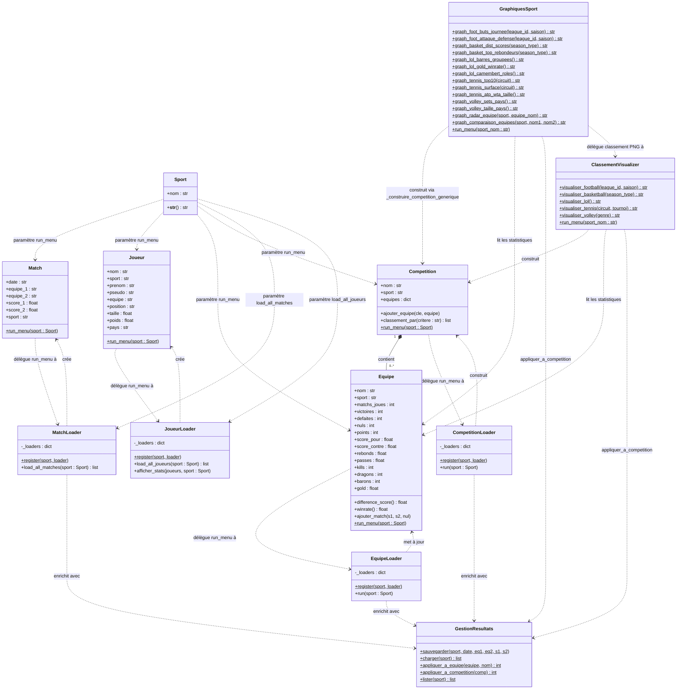

# Diagramme de classes

Ce diagramme peut être rendu :
- **GitHub / GitLab** : rendu natif du bloc Mermaid ci-dessous
- **En ligne** : [mermaid.live](https://mermaid.live)
- **VS Code** : extension *Mermaid Preview*

Note : les attributs optionnels de `Match` (`season`, `winner`, `patch`, `surface`, `round`, `tourney_name`) sont omis pour la lisibilité.

---

## Version Mermaid



---

## Notes d'architecture

### Pattern Dispatcher + Registre

Chaque `Loader` applique le même pattern :

```
MatchLoader.register("football", FootballMatchLoader)
MatchLoader.register("basketball", BasketballMatchLoader)
...
MatchLoader().load_all_matches(sport)   ← dispatch automatique
```

Ajouter un nouveau sport revient à créer une classe dans le fichier loader concerné
et à appeler `register` — sans modifier aucune autre classe.

### GestionResultats

Classe utilitaire à méthodes statiques qui persiste les nouveaux résultats dans
`data/resultats/nouveaux_matchs.csv`. Les loaders l'appellent automatiquement
pour intégrer ces résultats aux statistiques, classements et graphiques.

### GraphiquesSport & ClassementVisualizer

Deux classes du module `src/visualizer/` qui génèrent des fichiers PNG dans `output/` :
- `ClassementVisualizer` : tableaux de classement stylisés (style Ligue 1)
- `GraphiquesSport` : 26 graphiques statistiques (histogrammes, scatter, camemberts, radar…)

Toutes deux accèdent directement aux CSV via pandas et utilisent
`GestionResultats` pour intégrer les résultats manuels.
