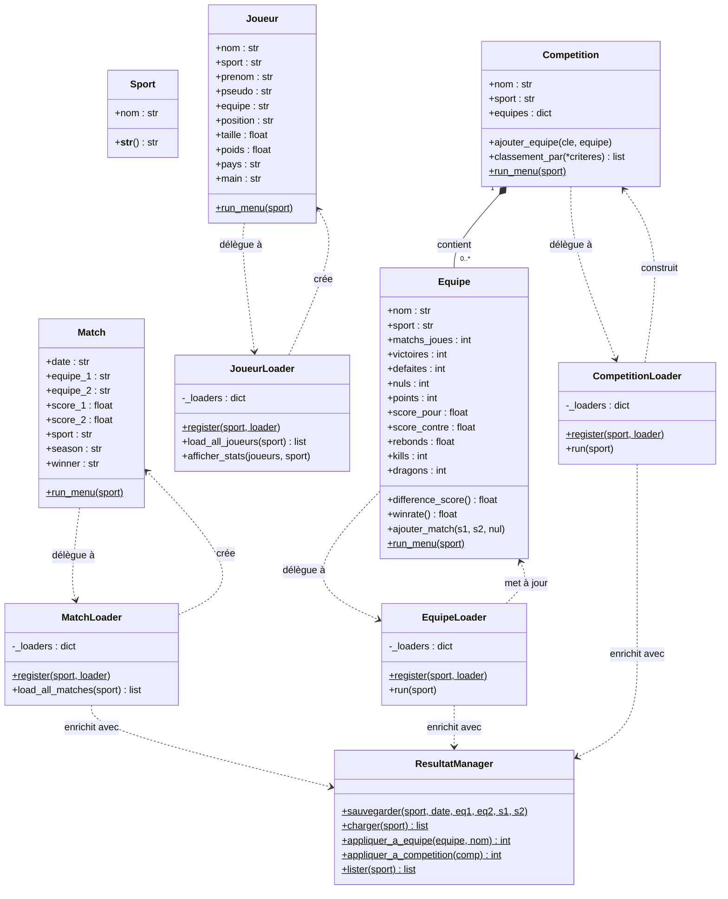

# Diagramme de classes

Ce diagramme peut être rendu :
- **En ligne** : copier le bloc `@startuml` dans [plantuml.com/plantuml](https://www.plantuml.com/plantuml/uml)
- **VS Code** : extension *PlantUML*
- **GitHub** : via le bloc Mermaid ci-dessous (rendu natif)

---

## Version Mermaid (rendu natif GitHub)



---

## Notes d'architecture

### Pattern Dispatcher + Registre

Chaque `Loader` (MatchLoader, JoueurLoader, EquipeLoader, CompetitionLoader) applique le même
pattern :

```
Loader.register("football", FootballLoader)   ← à l'import du module
Loader.register("basketball", BasketballLoader)
...
Loader().run(sport)   ← dispatch automatique selon le sport
```

Ajouter un sport revient à créer une classe dans le fichier loader concerné
et à appeler `register` — sans modifier aucune autre classe.

### ResultatManager

Classe utilitaire (méthodes statiques) qui gère la persistance des nouveaux
résultats dans `data/resultats/nouveaux_matchs.csv`. Les loaders l'appellent
automatiquement pour intégrer les résultats ajoutés manuellement aux
statistiques et classements existants.
