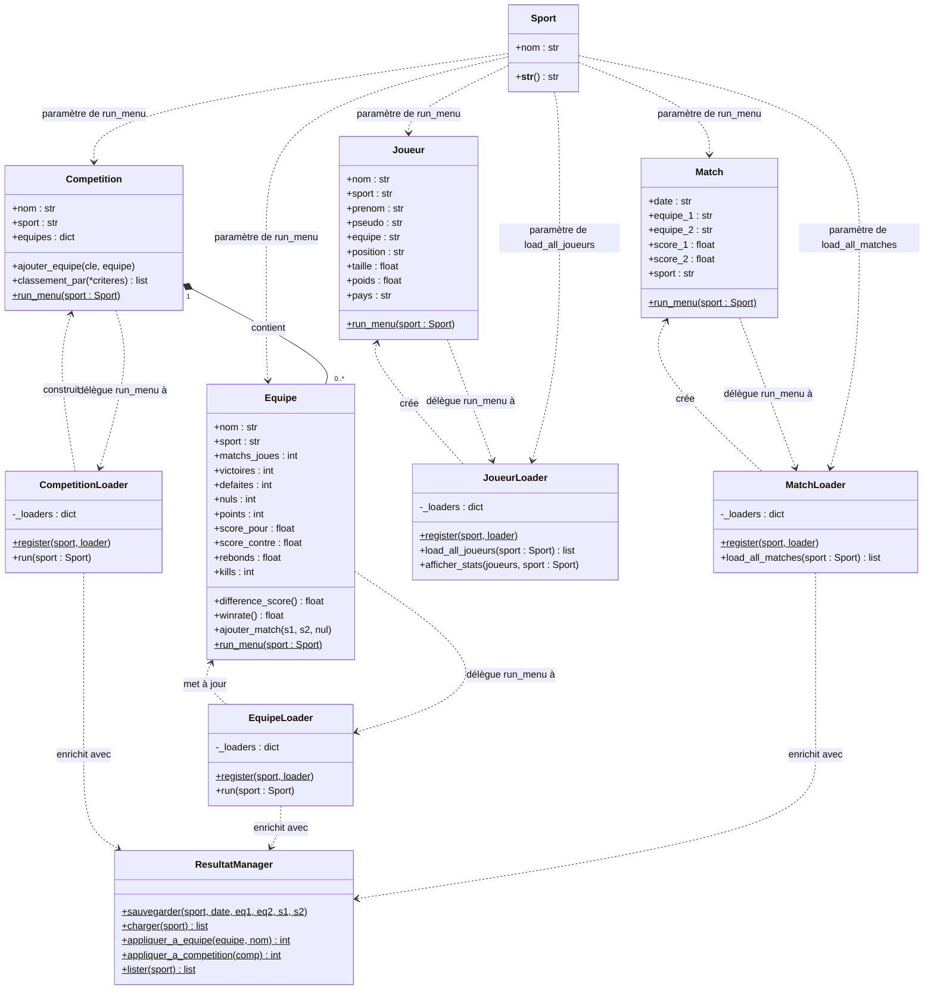

# Diagramme de classes

Ce diagramme peut être rendu :
- **En ligne** : copier le bloc `@startuml` dans [plantuml.com/plantuml](https://www.plantuml.com/plantuml/uml)
- **VS Code** : extension *PlantUML*
- **GitHub** : via le bloc Mermaid ci-dessous (rendu natif)

Note : seuls les attributs principaux de `Match` sont représentés pour la lisibilité
(`season`, `winner`, `patch`, `surface`, `round`, `tourney_name` sont omis).

---

## Version Mermaid (rendu natif GitHub)



---

## Notes d'architecture

### Pattern Dispatcher + Registre

Chaque `Loader` applique le même pattern :

```
MatchLoader.register("football", FootballMatchLoader)
MatchLoader.register("basketball", BasketballMatchLoader)
...
MatchLoader().load_all_matches(sport)   ← dispatch automatique
```

Ajouter un nouveau sport revient à créer une classe dans le fichier loader concerné
et à appeler `register` — sans modifier aucune autre classe.

### ResultatManager

Classe utilitaire à méthodes statiques qui persiste les nouveaux résultats dans
`data/resultats/nouveaux_matchs.csv`. Les loaders l'appellent automatiquement
pour intégrer ces résultats aux statistiques et classements existants.
