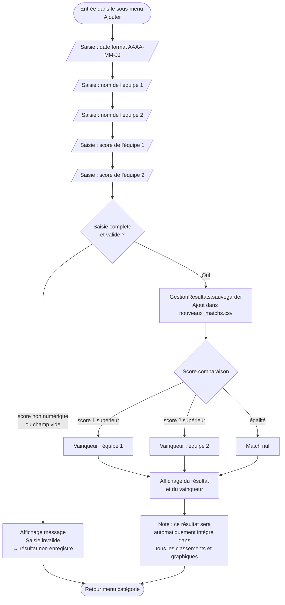

# Sous-menu Ajouter un résultat

```mermaid
flowchart TD
    START([Entrée dans le sous-menu Ajouter])

    START --> S1[/Saisie : date format AAAA-MM-JJ/]
    S1 --> S2[/Saisie : nom de l'équipe 1/]
    S2 --> S3[/Saisie : nom de l'équipe 2/]
    S3 --> S4[/Saisie : score de l'équipe 1/]
    S4 --> S5[/Saisie : score de l'équipe 2/]

    S5 --> VAL{Saisie complète\net valide ?}

    VAL -->|score non numérique\nou champ vide| ERR[Affichage message\nSaisie invalide\n→ résultat non enregistré]
    ERR --> BACK

    VAL -->|Oui| SAVE[GestionResultats.sauvegarder\nAjout dans nouveaux_matchs.csv]

    SAVE --> RESULT{Score comparaison}
    RESULT -->|score 1 supérieur| W1[Vainqueur : équipe 1]
    RESULT -->|score 2 supérieur| W2[Vainqueur : équipe 2]
    RESULT -->|égalité| WN[Match nul]

    W1 --> AFF[Affichage du résultat\net du vainqueur]
    W2 --> AFF
    WN --> AFF

    AFF --> NOTE[Note : ce résultat sera\nautomatiquement intégré dans\ntous les classements et graphiques]

    NOTE --> BACK([Retour menu catégorie])
```
