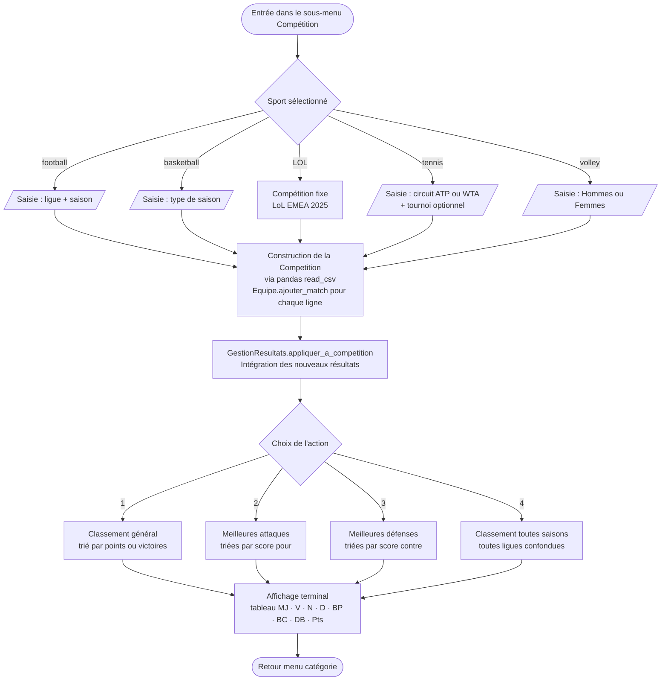

# Sous-menu Compétition

```mermaid
flowchart TD
    START([Entrée dans le sous-menu Compétition])

    START --> SPORT{Sport sélectionné}

    SPORT -->|football| SF[/Saisie : ligue + saison/]
    SPORT -->|basketball| SB[/Saisie : type de saison/]
    SPORT -->|LOL| SL[Compétition fixe\nLoL EMEA 2025]
    SPORT -->|tennis| ST[/Saisie : circuit ATP ou WTA\n+ tournoi optionnel/]
    SPORT -->|volley| SV[/Saisie : Hommes ou Femmes/]

    SF --> BUILD
    SB --> BUILD
    SL --> BUILD
    ST --> BUILD
    SV --> BUILD

    BUILD[Construction de la Competition\nvia pandas read_csv\nEquipe.ajouter_match pour chaque ligne]
    BUILD --> GR[GestionResultats.appliquer_a_competition\nIntégration des nouveaux résultats]

    GR --> MENU{Choix de l'action}

    MENU -->|1| C1[Classement général\ntrié par points ou victoires]
    MENU -->|2| C2[Meilleures attaques\ntriées par score pour]
    MENU -->|3| C3[Meilleures défenses\ntriées par score contre]
    MENU -->|4| C4[Classement toutes saisons\ntoutes ligues confondues]

    C1 --> AFF[Affichage terminal\ntableau MJ · V · N · D · BP · BC · DB · Pts]
    C2 --> AFF
    C3 --> AFF
    C4 --> AFF

    AFF --> BACK([Retour menu catégorie])
```
