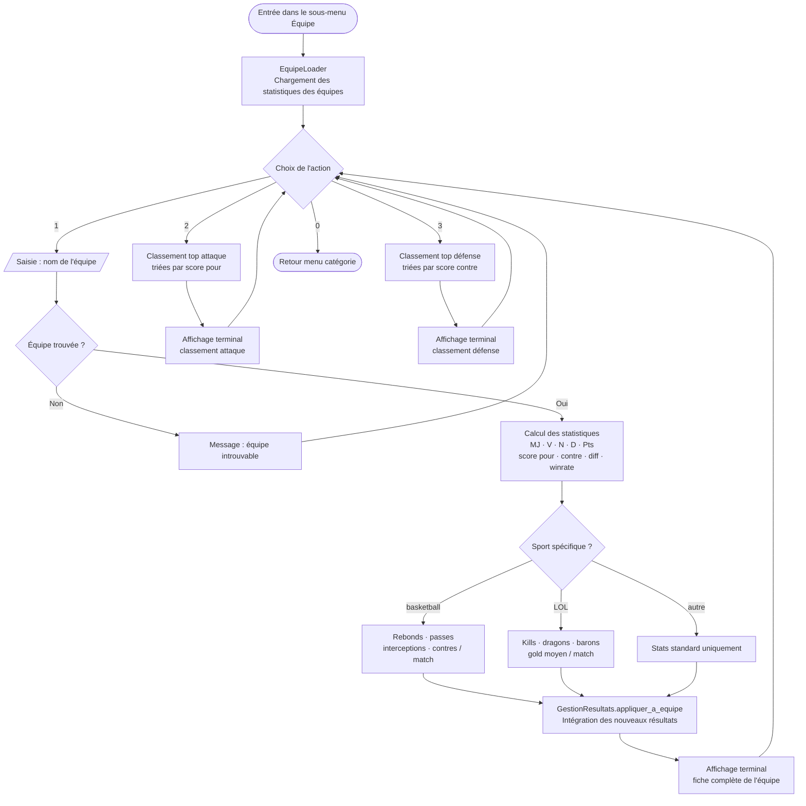

# Sous-menu Équipe

```mermaid
flowchart TD
    START([Entrée dans le sous-menu Équipe])
    START --> LOAD[EquipeLoader\nChargement des statistiques des équipes]

    LOAD --> MENU{Choix de l'action}

    MENU -->|1| E1[/Saisie : nom de l'équipe/]
    MENU -->|2| E2[Classement top attaque\ntriées par score pour]
    MENU -->|3| E3[Classement top défense\ntriées par score contre]
    MENU -->|0| BACK([Retour menu catégorie])

    E1 --> D1{Équipe trouvée ?}
    D1 -->|Non| ERR[Message : équipe introuvable]
    ERR --> MENU
    D1 -->|Oui| STATS[Calcul des statistiques\nMJ · V · N · D · Pts\nscore pour · contre · diff · winrate]

    STATS --> EXTRA{Sport spécifique ?}
    EXTRA -->|basketball| BK[Rebonds · passes\ninterceptions · contres / match]
    EXTRA -->|LOL| LOL[Kills · dragons · barons\ngold moyen / match]
    EXTRA -->|autre| STD[Stats standard uniquement]

    BK --> NEW[GestionResultats.appliquer_a_equipe\nIntégration des nouveaux résultats]
    LOL --> NEW
    STD --> NEW

    NEW --> AFF1[Affichage terminal\nfiche complète de l'équipe]
    E2 --> AFF2[Affichage terminal\nclassement attaque]
    E3 --> AFF3[Affichage terminal\nclassement défense]

    AFF1 --> MENU
    AFF2 --> MENU
    AFF3 --> MENU
```
