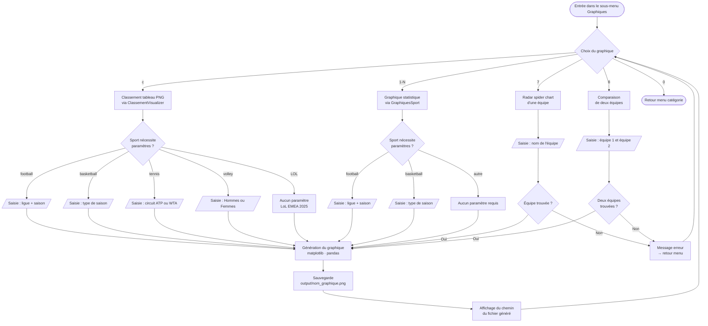

# Sous-menu Graphiques

```mermaid
flowchart TD
    START([Entrée dans le sous-menu Graphiques])
    START --> MENU{Choix du graphique}

    MENU -->|c| GC[Classement tableau PNG\nvia ClassementVisualizer]
    MENU -->|1-N| GS[Graphique statistique\nvia GraphiquesSport]
    MENU -->|7| GR[Radar spider chart\nd'une équipe]
    MENU -->|8| GCO[Comparaison\nde deux équipes]
    MENU -->|0| BACK([Retour menu catégorie])

    GC --> PARAM_C{Sport nécessite\nparamètres ?}
    GS --> PARAM_S{Sport nécessite\nparamètres ?}
    GR --> P_R[/Saisie : nom de l'équipe/]
    GCO --> P_C[/Saisie : équipe 1 et équipe 2/]

    PARAM_C -->|football| FC[/Saisie : ligue + saison/]
    PARAM_C -->|basketball| BC[/Saisie : type de saison/]
    PARAM_C -->|tennis| TC[/Saisie : circuit ATP ou WTA/]
    PARAM_C -->|volley| VC[/Saisie : Hommes ou Femmes/]
    PARAM_C -->|LOL| NOPARAM_C[Aucun paramètre\nLoL EMEA 2025]

    PARAM_S -->|football| FS[/Saisie : ligue + saison/]
    PARAM_S -->|basketball| BS[/Saisie : type de saison/]
    PARAM_S -->|autre| NOPARAM_S[Aucun paramètre requis]

    FC --> GEN
    BC --> GEN
    TC --> GEN
    VC --> GEN
    NOPARAM_C --> GEN
    FS --> GEN
    BS --> GEN
    NOPARAM_S --> GEN
    P_R --> D_R{Équipe trouvée ?}
    D_R -->|Non| ERR[Message erreur\n→ retour menu]
    ERR --> MENU
    D_R -->|Oui| GEN
    P_C --> D_C{Deux équipes\ntrouvées ?}
    D_C -->|Non| ERR
    D_C -->|Oui| GEN

    GEN[Génération du graphique\nmatplotlib · pandas]
    GEN --> SAVE[Sauvegarde\noutput/nom_graphique.png]
    SAVE --> AFF[Affichage du chemin\ndu fichier généré]
    AFF --> MENU
```
