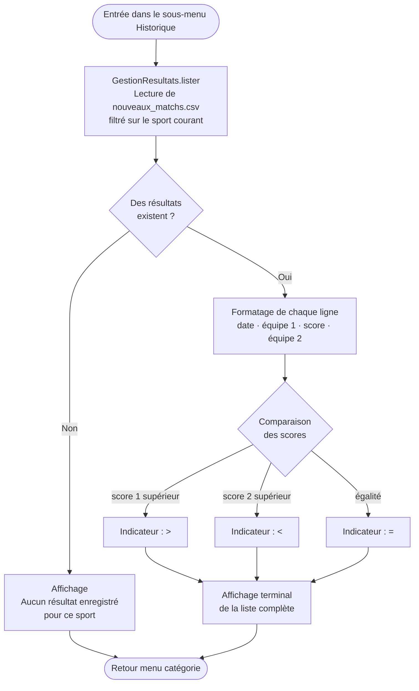

# Sous-menu Historique

```mermaid
flowchart TD
    START([Entrée dans le sous-menu Historique])

    START --> LOAD[GestionResultats.lister\nLecture de nouveaux_matchs.csv\nfiltré sur le sport courant]

    LOAD --> D1{Des résultats\nexistent ?}

    D1 -->|Non| EMPTY[Affichage\nAucun résultat enregistré\npour ce sport]
    EMPTY --> BACK

    D1 -->|Oui| FORMAT[Formatage de chaque ligne\ndate · équipe 1 · score · équipe 2]

    FORMAT --> COMP{Comparaison\ndes scores}
    COMP -->|score 1 supérieur| G1[Indicateur : >]
    COMP -->|score 2 supérieur| G2[Indicateur : <]
    COMP -->|égalité| GN[Indicateur : =]

    G1 --> AFF[Affichage terminal\nde la liste complète]
    G2 --> AFF
    GN --> AFF

    AFF --> BACK([Retour menu catégorie])
```
