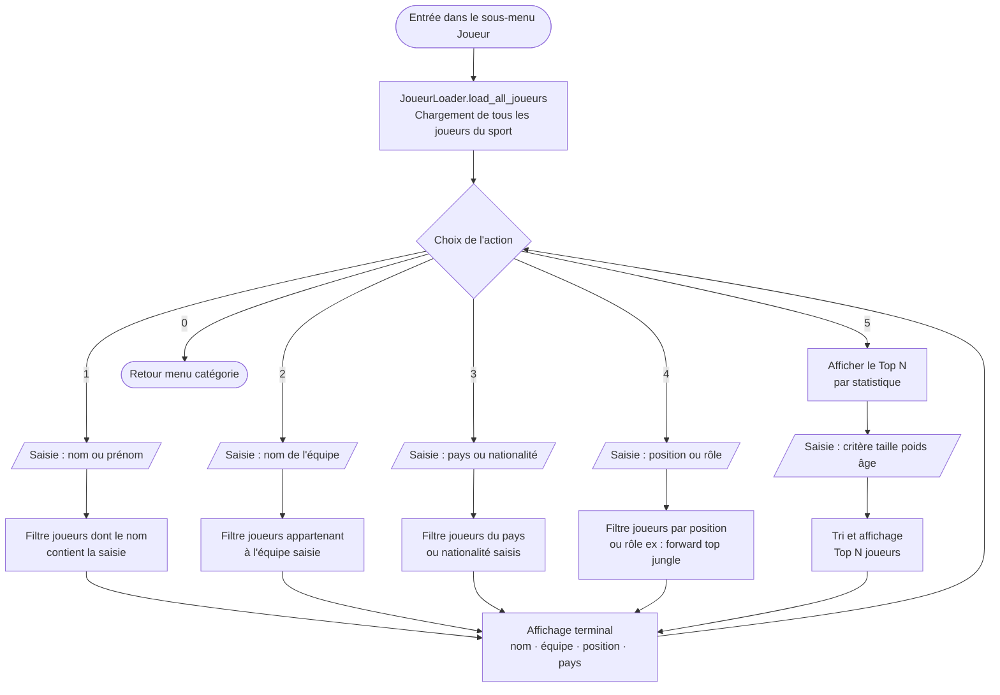

# Sous-menu Joueur

```mermaid
flowchart TD
    START([Entrée dans le sous-menu Joueur])
    START --> LOAD[JoueurLoader.load_all_joueurs\nChargement de tous les joueurs du sport]

    LOAD --> MENU{Choix de l'action}

    MENU -->|1| E1[/Saisie : nom ou prénom/]
    MENU -->|2| E2[/Saisie : nom de l'équipe/]
    MENU -->|3| E3[/Saisie : pays ou nationalité/]
    MENU -->|4| E4[/Saisie : position ou rôle/]
    MENU -->|5| E5[Afficher le Top N\npar statistique]
    MENU -->|0| BACK([Retour menu catégorie])

    E1 --> F1[Filtre joueurs dont le nom\ncontient la saisie]
    E2 --> F2[Filtre joueurs appartenant\nà l'équipe saisie]
    E3 --> F3[Filtre joueurs du pays\nou nationalité saisis]
    E4 --> F4[Filtre joueurs par position\nou rôle ex : forward top jungle]
    E5 --> F5[/Saisie : critère taille poids âge/]
    F5 --> S5[Tri et affichage\nTop N joueurs]

    F1 --> AFF[Affichage terminal\nnom · équipe · position · pays]
    F2 --> AFF
    F3 --> AFF
    F4 --> AFF
    S5 --> AFF
    AFF --> MENU
```
