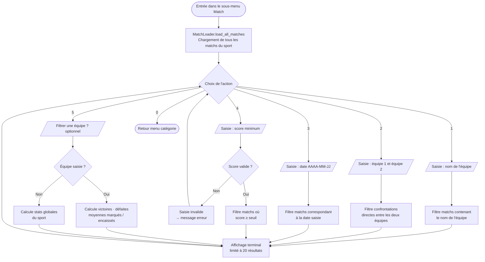

# Sous-menu Match

```mermaid
flowchart TD
    START([Entrée dans le sous-menu Match])
    START --> LOAD[MatchLoader.load_all_matches\nChargement de tous les matchs du sport]

    LOAD --> MENU{Choix de l'action}

    MENU -->|1| E1[/Saisie : nom de l'équipe/]
    MENU -->|2| E2[/Saisie : équipe 1 et équipe 2/]
    MENU -->|3| E3[/Saisie : date AAAA-MM-JJ/]
    MENU -->|4| E4[/Saisie : score minimum/]
    MENU -->|5| E5[/Filtrer une équipe ? optionnel/]
    MENU -->|0| BACK([Retour menu catégorie])

    E1 --> F1[Filtre matchs contenant\nle nom de l'équipe]
    E2 --> F2[Filtre confrontations\ndirectes entre les deux équipes]
    E3 --> F3[Filtre matchs correspondant\nà la date saisie]
    E4 --> D4{Score valide ?}
    D4 -->|Non| ERR4[Saisie invalide\n→ message erreur]
    D4 -->|Oui| F4[Filtre matchs où\nscore ≥ seuil]
    E5 --> F5{Équipe saisie ?}
    F5 -->|Oui| S5A[Calcule victoires · défaites\nmoyennes marqués / encaissés]
    F5 -->|Non| S5B[Calcule stats globales\ndu sport]

    F1 --> AFF[Affichage terminal\nlimité à 20 résultats]
    F2 --> AFF
    F3 --> AFF
    ERR4 --> MENU
    F4 --> AFF
    S5A --> AFF
    S5B --> AFF
    AFF --> MENU
```
